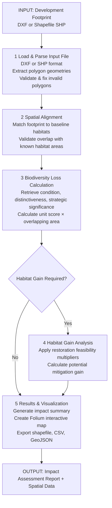

# Biodiversity-Tool-2026
This tool was developed by Shaymaa Yousef S. Hammash, a Bio-engineer and Master's Student at Ghent University (2024-2026). For any questions or feedback, you can reach out via email at shaymapal@gmail.com. 
The tool is based on the UK Biodiversity Metric by DEFRA and is distributed under the Open Government Licence (OGL v3.0), which can be found at https://www.nationalarchives.gov.uk/doc/open-government-licence/version/3/. Developer notes: this tool was created to assist campus planners at Ghent University in evaluating the impact of new construction on biodiversity levels on campus, as well as to assess the added biodiversity value of new habitats.
# Biodiversity Impact Assessment Tool


## What This Project Does

The Biodiversity Impact Assessment Tool automates the complex workflow of measuring how proposed developments affect local ecosystems. It:

1. **Loads baseline habitat data** from lookup tables to establish reference conditions
2. **Ingests development footprints** from CAD drawings (DXF format) or shapefiles (SHP) and converts them to geospatial data
3. **Calculates biodiversity impact** by analyzing overlap between baseline habitats and planned development areas
4. **Quantifies habitat loss** using multi-factor scoring that considers habitat condition, rarity, and strategic importance
5. **Supports mitigation planning** by allowing users to model habitat gain/restoration scenarios
6. **Generates visual outputs** including interactive maps (Folium) and static visualizations
7. **Exports results** to multiple formats (shapefiles, CSV, GeoJSON) for further analysis and reporting

### Key Features

- **Flexible scoring model**: Biodiversity loss calculated from condition, distinctiveness, and strategic significance
- **Interactive GUI**: Intuitive workflow for loss analysis, gain analysis, and result comparison
- **Spatial validation**: Automatic checks for alignment between development footprints and habitat baselines
- **Multiple export options**: Shapefile, CSV, and interactive web maps
- **Bundled executable**: Self-contained distribution with all geospatial dependencies included
- **Bilingual support**: English and Dutch language manuals
- **Developer-friendly**: Built on standard geospatial Python stack (GeoPandas, Shapely, Fiona)

## Overall Pipeline and Logic Flow



## Project Structure

### Main Files

| File | Purpose |
|------|---------|
| **BiodiversityTool_2026JuneVersion.py** | Primary application. Contains the full GUI, all biodiversity calculation logic, spatial processing functions, and file I/O. This is the main entry point for end users. |
| **SetupJune2026_Map.py** | Build and deployment script. Handles configuration of geospatial library paths (PROJ, GDAL, matplotlib) for both development environments and frozen executables created with cx_Freeze. Used during packaging. |
| **archive/** | Older versions of the tool and setup scripts. Kept for reference only. |

### Data Files

| File | Purpose |
|------|---------|
| **data/all_habitats.csv** | Lookup table defining all habitat types and their baseline attributes (condition, distinctiveness, strategic significance). Used to score habitat loss calculations. |
| **data/target_year.csv** | Reference year and target year definitions for baseline comparisons. |

### Documentation

| File | Purpose |
|------|---------|
| **manuals/manual_english.pdf** | User guide in English with step-by-step instructions and examples. |
| **manuals/manual_nederlands.pdf** | User guide in Dutch (Nederlands). |

### Build Resources

| Directory | Purpose |
|-----------|---------|
| **build/** | Contains frozen executable distribution with bundled Python environment, all dependencies, data files, and library resources. Generated by cx_Freeze during packaging. |
| **logos/** | Brand logos and images used in the GUI. |

### Configuration

| Item | Details |
|------|---------|
| **requirements.txt** | Python package dependencies (GeoPandas, Shapely, Fiona, pyproj, pandas, numpy, ezdxf, Pillow, cx_Freeze, rtree, certifi). Compatible with Python 3.13.9. |

## Biodiversity Score Calculation

The tool calculates biodiversity loss using this formula:

```
Biodiversity Loss (units) = Area (m²) × Condition_Weight × Distinctiveness_Value × Strategic_Weight

Where:
  • Condition_Weight:      "Good" = 3.0, "Fairly Good" = 2.5, "Moderate" = 2.0, "Fairly poor" = 1.5, "Poor" = 1.0
  • Distinctiveness_Value: "V.High" = 8, "High" = 6, "Medium" = 4, "Low" = 2, "V.Low" = 0
  • Strategic_Weight:      "High" = 1.15, "Medium" = 1.1, "Low" = 1.0
```

### Habitat Gain Calculation

For restoration/mitigation, gain is calculated by reducing the loss factor by feasibility multipliers:

```
Potential Gain = Restored_Area × Condition_Multiplier × Difficulty_Multiplier × Spatial_Proximity_Multiplier

Where:
  • Difficulty_Multiplier:         "Very high" = 0.1, "High" = 0.33, "Medium" = 0.67, "Low" = 1.0
  • Spatial_Proximity_Multiplier:  "On-site" = 1.0, "Within same city" = 0.75, "Somewhere further" = 0.5
```

## How to Run

### Prerequisites

- **Python 3.13.9** or compatible version
- **Windows/Linux/Mac** with access to a command line
- **Spatial libraries**: PROJ, GDAL (installed via GeoPandas package)

### Installation (Development Environment)

1. **Clone or download** the project to your local machine:
   ```bash
   cd d:\my_projects\BiodiversityApp
   ```

2. **Create a virtual environment** (recommended):
   ```bash
   python -m venv venv
   venv\Scripts\activate  # On Windows
   # source venv/bin/activate  # On macOS/Linux
   ```

3. **Install dependencies**:
   ```bash
   pip install -r requirements.txt
   ```

4. **Configure geospatial paths** (if needed):
   The application automatically configures PROJ and matplotlib paths. If you encounter geospatial errors, run the path configuration script:
   ```bash
   python SetupJune2026_Map.py
   ```

5. **Run the application**:
   ```bash
   python BiodiversityTool_2026JuneVersion.py
   ```

### Using the Bundled Executable

If you have a packaged executable distribution in the `build/` folder:

1. Navigate to the build directory
2. Run `BiodiversityCalculator.exe` as administrator (no Python installation required)
3. All dependencies and data are included

### First Time Use

1. **Read the manual**: Open `manuals/manual_english.pdf` or `manual_nederlands.pdf` for detailed instructions
2. **Prepare your data**:
   - Have your baseline habitat shapefile or GeoDataFrame ready
   - Have your development footprint ready as a CAD drawing (DXF) or shapefile (SHP)
3. **Launch the GUI**:
   - Use the main menu to select your workflow: Loss Analysis, Gain Analysis, or Comparison
   - Follow the on-screen prompts to load files and configure parameters
4. **Export results**: Use the export functions to save maps and data files

## Typical Workflow

### Scenario: Assessing a New Development Project

1. **Launch application**: `python BiodiversityTool_2026JuneVersion.py`
2. **Load baseline habitat data**: Import shapefile with existing habitat polygons and attributes
3. **Import development footprint**: Load CAD drawing (DXF) or shapefile (SHP) of proposed development
4. **Review spatial alignment**: Verify that development area overlaps with baseline habitat map
5. **Calculate biodiversity loss**: Tool automatically scores all affected habitats
6. **Model mitigation options**: Input restoration/gain scenarios in the Gain Analysis tab
7. **Compare results**: View side-by-side impacts in the Comparison view
8. **Export report**: Generate interactive map and export data to shapefile/CSV for final report

## Technical Details

### Spatial Processing

- **Geometry handling**: Shapely library for polygon operations and spatial validation
- **Geospatial data**: GeoPandas for managing and analyzing spatial features
- **File I/O**: Fiona for reading/writing shapefiles, pyproj for coordinate reference system handling
- **CAD parsing**: ezdxf for reading AutoCAD DXF format

### Visualization

- **Interactive maps**: Folium library for web-based map rendering
- **Static visualizations**: Matplotlib for charts and diagrams in GUI
- **GUI framework**: Tkinter for cross-platform user interface

### Data Validation

- The tool validates:
  - DXF/SHP geometry validity and self-intersection
  - Polygon coordinate alignment with baseline data
  - CSV lookup table column names and data types
  - Required attributes on habitat polygons

## Troubleshooting

### Geospatial Path Errors

If you see errors about PROJ or GDAL:
- Run `python SetupJune2026_Map.py` to reconfigure paths
- Ensure `PROJ_LIB` environment variable points to valid library directory
- Reinstall geopandas: `pip install --force-reinstall geopandas==1.0.1`

### Memory Issues with Large Files

- Close unnecessary applications
- Process large DXF/shapefiles in sections
- Consider splitting development footprints into smaller polygons

### GUI Display Issues

- Ensure matplotlib backend is set to `Agg` (non-interactive)
- On Linux, you may need `sudo apt-get install python3-tk`

## Development

### Adding New Habitat Types

1. Add row to `data/all_habitats.csv` with habitat name and attributes
2. Update `REQUIRED_BASE_COLS` in main application if column names change
3. Restart application

### Modifying Scoring Weights

Edit these constants in `BiodiversityTool_2026JuneVersion.py`:
```python
CONDITION_MAPPING = {"Good": 3.0, "Fairly Good": 2.5, ...}
DISTINCTIVENESS_MAP = {"V.High": 8, "High": 6, ...}
SPATIAL_MAPPING = {"On-site": 1.0, "Within same city": 0.75, ...}
```

### Building a Frozen Executable

Use `SetupJune2026_Map.py` with cx_Freeze:
```bash
python SetupJune2026_Map.py build
```

## Support and Contact

- For user questions: Refer to the manual in `manuals/`
- For technical issues: Check code comments and docstrings in main Python files
- For contributions: Ensure code follows Google-style docstring format

## License

This project uses open-source geospatial libraries. Refer to individual package licenses in `build/biodiversity_calculator/frozen_application_license.txt`.

---

**Last Updated**: June 2026
**Version**: 2026 June Release
**Python Version**: 3.13.9
